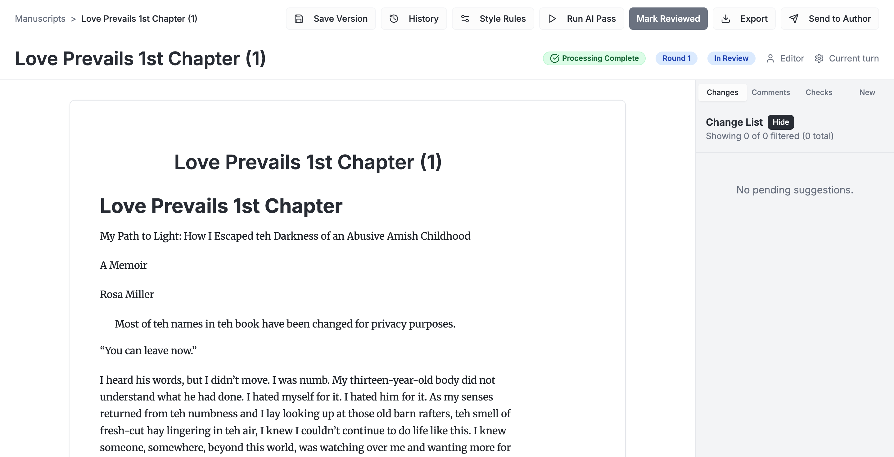
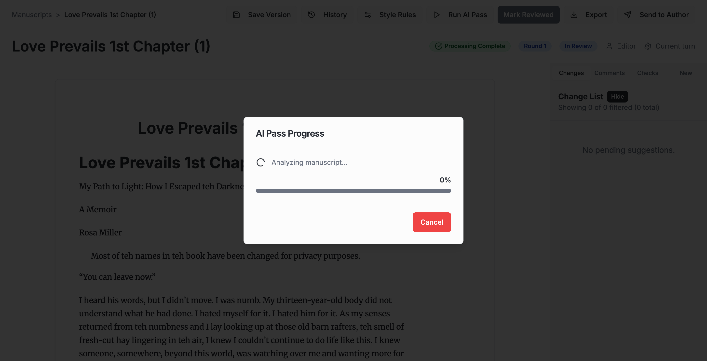
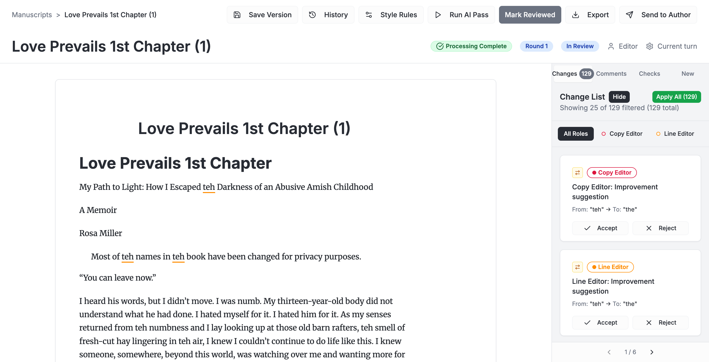
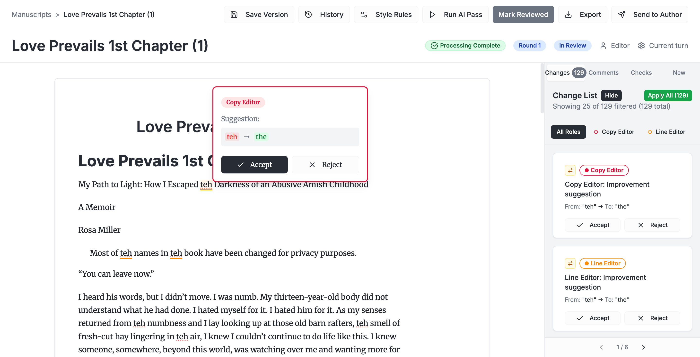

# User Acceptance Testing: AI Pass Feature

**What You'll Be Testing**: The AI Pass feature that automatically reviews your manuscript and provides editing suggestions

**Time Needed**: 20-30 minutes

**Last Updated**: October 7, 2025

---

## What is an AI Pass?

An AI Pass is when artificial intelligence editors review your manuscript and suggest improvements. Think of it like having professional Copy Editors and Line Editors review your work, but powered by AI. The system will analyze your text and suggest corrections for spelling, grammar, style, and clarity.

---

## Getting Started

### Step 1: Open the Application

Go to your manuscript dashboard. You'll see a list of all your manuscripts.

**What you'll see:**
- A table showing all your manuscripts
- Manuscript titles, authors, word counts, and status
- Each manuscript is clickable

---

### Step 2: Open Your Manuscript

Click on the manuscript you want to test (we recommend testing with "Love Prevails 1st Chapter" or any manuscript under 30,000 words for best performance).

**What you'll see:**
- Your manuscript text in the main editor
- A toolbar at the top with various buttons
- The manuscript title and status information
- Your document content ready for editing

---

## Running the AI Pass

### Step 3: Click "Run AI Pass"

Look for the **"Run AI Pass"** button in the top toolbar and click it.

**What you'll see:**
- A dialog box will appear titled "AI Editor Roles"
- You'll see a list of different AI editor types (Copy Editor, Line Editor, etc.)
- Some editors will be pre-selected by default
- Each editor type specializes in different aspects of editing

**What to do:**
- Review the selected editors (Copy Editor and Line Editor are recommended for most documents)
- You can select or deselect editor types based on what you want reviewed
- Click the **"Run AI Pass"** button in the dialog to start

---

### Step 4: Watch the Progress

After clicking "Run AI Pass", you'll see a progress dialog.

**What you'll see:**
- A progress dialog showing the AI Pass is running
- A percentage or progress indicator
- Status messages like "Analyzing your manuscript..."

**What to expect:**
- **For documents under 10K words**: 2-5 minutes
- **For documents 10K-30K words**: 5-10 minutes
- **For documents 30K-60K words**: 10-20 minutes
- The browser will remain responsive - you can leave the tab open and check back

**Important:** Don't close the browser tab or refresh the page while the AI Pass is running.

---

## Reviewing the Results

### Step 5: View Your Suggestions

Once the AI Pass completes, the progress dialog will close automatically and you'll see your manuscript with AI suggestions.

**What you'll see:**
- Your manuscript text with highlighted suggestions
- Suggestions appear as underlined or colored text in the editor
- A sidebar on the right showing all suggestions
- A count of total suggestions (e.g., "129 suggestions")

**What to look for:**
- ✅ Are the suggestions visible in the editor text?
- ✅ Does the sidebar show the list of changes?
- ✅ Can you see different types of suggestions (Copy Editor, Line Editor)?

---

### Step 6: Interact with a Suggestion

Click on any highlighted suggestion in your manuscript text to see the details.

**What you'll see:**
- An inline popover showing the suggestion details
- The editor type (Copy Editor, Line Editor, etc.)
- "From:" showing the original text
- "To:" showing the suggested change
- **Accept** and **Reject** buttons

**What to test:**
- Click different suggestions to see if popovers appear correctly
- Try clicking **Accept** to apply a suggestion
- Try clicking **Reject** to dismiss a suggestion
- Check if the sidebar updates when you accept/reject suggestions

---

## What We're Testing

### ✅ Core Functionality Checklist

As you go through the steps above, verify that:

1. **Dashboard Works**
   - [ ] You can see your manuscript list
   - [ ] You can click on a manuscript to open it

2. **Editor Loads**
   - [ ] The manuscript opens in the editor
   - [ ] You can see the "Run AI Pass" button
   - [ ] The text displays correctly

3. **AI Pass Configuration**
   - [ ] The AI Editor selection dialog appears when you click "Run AI Pass"
   - [ ] You can see different editor types
   - [ ] The "Run AI Pass" button in the dialog is clickable

4. **Processing**
   - [ ] The progress dialog appears after starting the AI Pass
   - [ ] You can see progress updates
   - [ ] The browser doesn't freeze or crash

5. **Results Display**
   - [ ] Suggestions appear in the editor after processing completes
   - [ ] The sidebar shows a list of suggestions
   - [ ] Suggestions are highlighted in the manuscript text
   - [ ] You can see the count of total suggestions

6. **Interaction**
   - [ ] Clicking a suggestion shows the popover with details
   - [ ] You can accept suggestions
   - [ ] You can reject suggestions
   - [ ] The interface remains responsive

---

## Expected Results

### What Success Looks Like

**For a typical manuscript (10K-60K words):**
- AI Pass completes in 5-20 minutes
- 100-500+ suggestions generated (varies by content and quality)
- No browser freezing or crashes
- All suggestions are visible and interactive
- Accept/Reject buttons work correctly

### Common Suggestion Types You'll See

- **Spelling corrections**: "teh" → "the"
- **Grammar fixes**: "tehy were" → "they were"
- **Style improvements**: "on a rotating basis" → "follow a rotating schedule"
- **Clarity enhancements**: Rephrasing for better readability

---

## Reporting Issues

If something doesn't work as expected, please note:

### ❌ Issues to Report

- AI Pass button doesn't appear or isn't clickable
- Dialog doesn't open when clicking "Run AI Pass"
- Progress dialog freezes or shows errors
- Processing takes longer than 20 minutes without completion
- No suggestions appear after processing completes
- Browser crashes or becomes unresponsive
- Suggestions aren't clickable
- Accept/Reject buttons don't work
- Sidebar doesn't show suggestion list

### ℹ️ Information to Include

When reporting an issue, please provide:
1. **What you were doing** (which step in this guide)
2. **What you expected to happen**
3. **What actually happened**
4. **Manuscript details** (title, approximate word count)
5. **How long you waited** (if related to processing time)
6. **Any error messages** you saw

---

## Tips for Best Results

### ✅ Recommendations

- **Start with smaller documents** (under 30K words) for faster testing
- **Keep the browser tab open** while the AI Pass is running
- **Don't refresh the page** during processing
- **Wait for completion** - the progress dialog will close automatically
- **Test different editor types** - try different combinations to see what works best

### 📊 Performance Expectations

| Document Size | Expected Time | Expected Suggestions |
|---------------|---------------|---------------------|
| 5K-10K words  | 2-5 minutes   | 50-150 suggestions  |
| 10K-30K words | 5-10 minutes  | 150-400 suggestions |
| 30K-60K words | 10-20 minutes | 400-1000 suggestions|

*Note: Times may vary based on content complexity and selected editor types*

---

## Questions?

If you have questions or run into any issues during testing:
- Document what you were trying to do
- Note any error messages or unexpected behavior
- Take screenshots if possible
- Include the manuscript name and approximate word count

Thank you for testing the AI Pass feature! Your feedback helps us make the manuscript editor better.

---

**Test Status**: Ready for User Acceptance Testing
**Feature**: AI Pass with TipTap Pro AI Suggestions
**Tested On**: Love Prevails 1st Chapter (successful with 129 suggestions)
