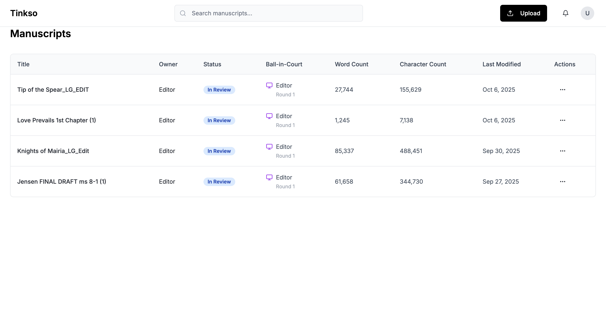
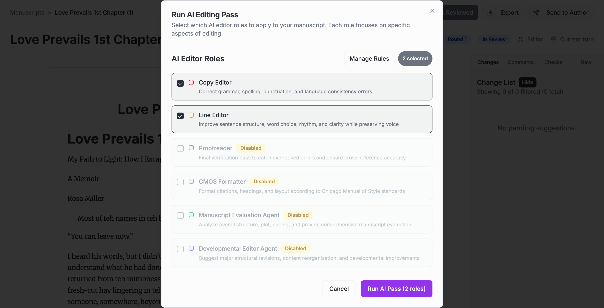

# User Acceptance Testing: Manage AI Editor Roles

**What You'll Be Testing**: The ability to customize which AI editors are available and configure their rules

**Time Needed**: 10-15 minutes

**Last Updated**: October 7, 2025

---

## What are AI Editor Roles?

AI Editor Roles are the different types of professional editors that can review your manuscript. Each role specializes in different aspects of editing:
- **Copy Editor**: Checks spelling, grammar, and basic style
- **Line Editor**: Improves sentence structure and flow
- **Content Editor**: Suggests improvements to story and structure
- **Proofreader**: Final polish for typos and formatting

You can enable/disable these roles and customize their instructions to match your specific needs.

---

## Getting Started

### Step 1: Open the Application

Go to your manuscript dashboard and open any manuscript.

**What you'll see:**
- A table showing all your manuscripts
- Click any manuscript to open it in the editor

---

### Step 2: Access AI Editor Roles

In the editor, click the **"Run AI Pass"** button in the top toolbar.

**What you'll see:**
- A dialog titled "AI Editor Roles"
- A list of available AI editor types with checkboxes
- A **"Manage Rules"** button at the bottom left
- Currently selected editors will have checkmarks

**What to do:**
- Click the **"Manage Rules"** button to open the management interface

---

## Managing AI Editor Roles

### Step 3: View the Manage Rules Dialog

After clicking "Manage Rules", a new dialog will appear.

**What you'll see:**
- A list of all AI Editor Roles
- Each role has:
  - A name (Copy Editor, Line Editor, etc.)
  - An enable/disable toggle switch
  - An edit icon (pencil) button
- Enabled roles have the toggle switched on (blue/green)
- Disabled roles have the toggle switched off (gray)

**What to test:**
- Review all available AI editor roles
- Check which roles are currently enabled
- Notice the edit icons next to each role

---

### Step 4: Enable or Disable a Role

Click the toggle switch next to any AI editor role to enable or disable it.

**What to expect:**
- ✅ Toggle switches should respond immediately
- ✅ Enabled roles show a colored (blue/green) toggle
- ✅ Disabled roles show a gray toggle
- ✅ You should be able to toggle multiple roles on and off

**What to test:**
- Disable an enabled role - the toggle should turn gray
- Enable a disabled role - the toggle should turn colored
- Try toggling several roles to confirm the controls work smoothly

---

### Step 5: Edit an AI Editor Role

Click the **edit icon** (pencil button) next to any AI editor role.

**What you'll see:**
- A new dialog or form for editing the AI editor role
- Fields to modify:
  - **Role Name**: The name of the editor type
  - **Instructions/Rules**: Text describing what this editor should focus on
  - **System Prompt**: Technical instructions for the AI
- **"Save Changes"** button to confirm your edits
- **"Cancel"** or close button to discard changes

**What to test:**
- Click edit on different roles to see their configurations
- Try modifying the role name
- Try editing the instructions or rules
- Check that the fields display the current values correctly

---

### Step 6: Save Your Changes

After making edits, click the **"Save Changes"** button.

**What to expect:**
- ✅ The edit dialog should close
- ✅ You should return to the Manage Rules dialog
- ✅ Your changes should be reflected in the role list
- ✅ Modified roles should show updated information

**What to test:**
- Verify your edits were saved
- Check that the role list reflects any name changes
- Confirm the toggles show the correct enabled/disabled state

---

### Step 7: Return to AI Editor Selection

Close the Manage Rules dialog to return to the AI Editor selection dialog.

**What you'll see:**
- The AI Editor Roles dialog
- Only enabled roles should appear in the selection list
- Disabled roles should not be visible
- Your custom role names should be displayed

**What to test:**
- ✅ Confirm that disabled roles are not shown
- ✅ Verify enabled roles appear in the list
- ✅ Check that any renamed roles show their new names
- ✅ Ensure you can still select/deselect roles for the AI Pass

---

## What We're Testing

### ✅ Core Functionality Checklist

As you go through the steps above, verify that:

1. **Access Management**
   - [ ] "Manage Rules" button is visible in the AI Editor selection dialog
   - [ ] Clicking "Manage Rules" opens the management interface
   - [ ] You can access the management dialog from the editor

2. **View Roles**
   - [ ] All AI editor roles are listed
   - [ ] Each role shows its name
   - [ ] Toggle switches display current enabled/disabled state
   - [ ] Edit icons are visible for each role

3. **Enable/Disable Roles**
   - [ ] Toggle switches are clickable
   - [ ] Toggling a role immediately updates its state
   - [ ] Visual feedback shows enabled (colored) vs disabled (gray)
   - [ ] Changes persist when you close and reopen the dialog

4. **Edit Roles**
   - [ ] Edit icons are clickable
   - [ ] Edit dialog opens with current role configuration
   - [ ] You can modify role name and instructions
   - [ ] "Save Changes" button is present and clickable
   - [ ] "Cancel" or close option is available

5. **Save Changes**
   - [ ] Saving edits closes the edit dialog
   - [ ] Changes appear in the role list
   - [ ] Modified roles show updated information
   - [ ] System remembers your changes

6. **Integration**
   - [ ] Disabled roles don't appear in AI Editor selection
   - [ ] Enabled roles are available for selection
   - [ ] Custom names are reflected in the selection dialog
   - [ ] The overall AI Pass workflow still works correctly

---

## Expected Results

### What Success Looks Like

**Role Management:**
- You can see all available AI editor roles
- Toggle switches respond immediately when clicked
- Enabled and disabled states are clearly visible
- Changes are saved and persist across sessions

**Role Editing:**
- Edit dialog opens for each role
- Current configuration is displayed correctly
- You can modify names and instructions
- Saves are successful and reflected immediately

**Integration:**
- Only enabled roles appear in the AI Editor selection
- Disabled roles are hidden from selection
- Custom role names are used throughout the interface
- AI Pass continues to work with customized roles

---

## Reporting Issues

If something doesn't work as expected, please note:

### ❌ Issues to Report

- "Manage Rules" button doesn't appear or isn't clickable
- Management dialog doesn't open
- Toggle switches don't respond to clicks
- Toggled states don't reflect correctly (visual mismatch)
- Edit icons don't open the edit dialog
- Edit dialog shows incorrect or empty values
- "Save Changes" button doesn't work
- Changes don't persist after closing dialogs
- Disabled roles still appear in AI Editor selection
- Custom role names don't appear in selection dialog
- Error messages appear when saving changes
- Interface freezes or becomes unresponsive

### ℹ️ Information to Include

When reporting an issue, please provide:
1. **What you were doing** (which step in this guide)
2. **What you expected to happen**
3. **What actually happened**
4. **Which AI editor role** you were working with
5. **What changes you tried to make** (if editing)
6. **Any error messages** you saw
7. **Screenshots** if possible

---

## Tips for Best Results

### ✅ Recommendations

- **Test all roles**: Try enabling/disabling each role to ensure they all work
- **Make small edits first**: Test with minor changes before making major modifications
- **Verify persistence**: Close and reopen dialogs to confirm changes are saved
- **Test the full workflow**: After managing roles, run an AI Pass to ensure integration works
- **Keep at least one role enabled**: Disabling all roles may prevent running AI Passes

### 🎯 Test Scenarios to Try

1. **Disable a default role** (e.g., turn off Line Editor)
   - Verify it disappears from the selection dialog
   - Run an AI Pass to confirm only enabled roles are used

2. **Rename a role** (e.g., change "Copy Editor" to "Grammar Expert")
   - Verify the new name appears throughout the interface
   - Confirm the role still functions correctly

3. **Edit role instructions**
   - Modify the instructions for a role
   - Run an AI Pass and verify the AI follows the new instructions

4. **Enable a disabled role**
   - Turn on a previously disabled role
   - Verify it appears in the selection dialog
   - Confirm it works when running an AI Pass

---

## Questions?

If you have questions or run into any issues during testing:
- Document what you were trying to do
- Note any error messages or unexpected behavior
- Take screenshots of the management interface
- Record which roles you were modifying

Thank you for testing the Manage AI Editor Roles feature! Your feedback helps us ensure editors can be customized to meet your specific needs.

---

**Test Status**: Ready for User Acceptance Testing
**Feature**: Manage AI Editor Roles
**Key Areas**: Enable/disable roles, edit role configurations, role selection integration
